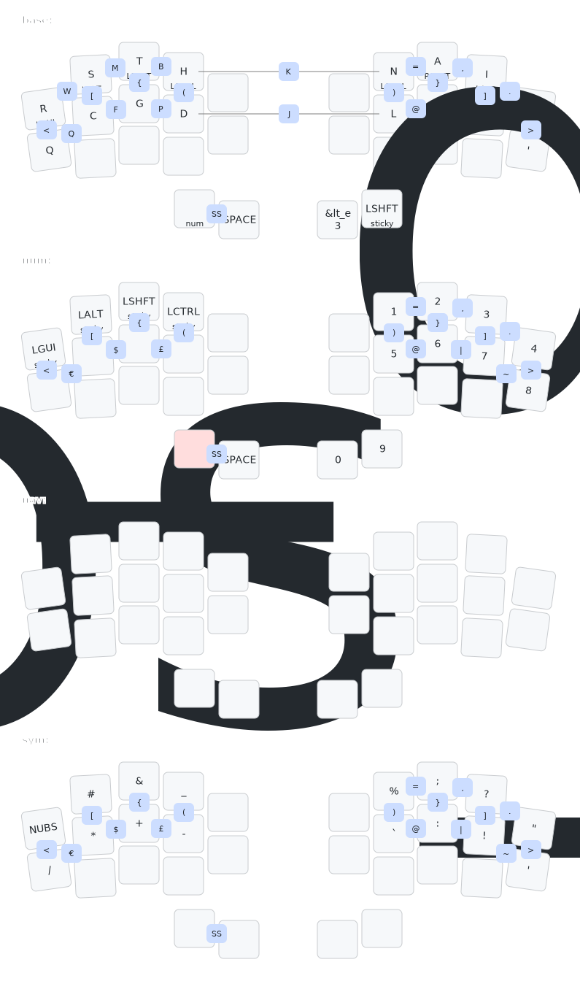

# zmk-config
This is my personal [ZMK firmware](https://github.com/ochief/zmk) configuration for my current 30-key wireless keyboard [Wizza](https://github.com/AlaaSaadAbdo/battoota) by [@AlaaSaadAbdo](https://github.com/AlaaSaadAbdo).

## Layout

## Links
- [Official ZMK](https://github.com/zmkfirmware/zmk)
- [Urob ZMK](https://github.com/urob/zmk)

## Keymap Drawer
- [Web UI](https://caksoylar.github.io/keymap-drawer)
- [Github](https://github.com/caksoylar/keymap-drawer)
- *Author:* [@braveKarma](https://github.com/caksoylar)
