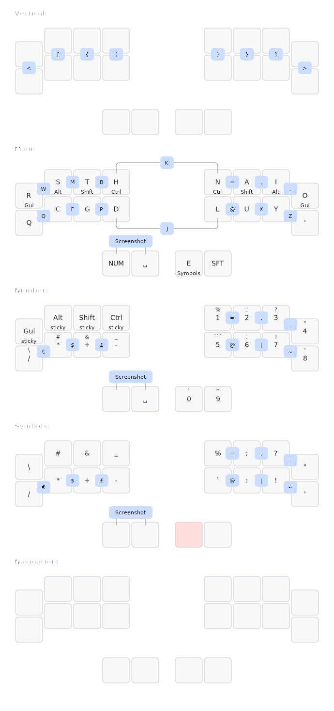

# zmk-config
This is my personal [ZMK firmware](https://github.com/ochief/zmk) configuration for my current 30-key wireless keyboard [Wizza](https://github.com/AlaaSaadAbdo/battoota) by [@AlaaSaadAbdo](https://github.com/AlaaSaadAbdo).

## Wizza Layout

<!--
## Combos

  
Number

  

  
Days of the Week

  

  
Months - Full

  

  
Months - Short

  

  
Functions

  

  
Entities

  

  
Field Types

  

  
Glossary

 

  
Personal

  

-->
## Links
- [Official ZMK](https://github.com/zmkfirmware/zmk)
- [Urob ZMK](https://github.com/urob/zmk)

## Keymap Drawer
- [Web UI](https://caksoylar.github.io/keymap-drawer)
- [Github](https://github.com/caksoylar/keymap-drawer)
- *Author:* [@braveKarma](https://github.com/caksoylar)
